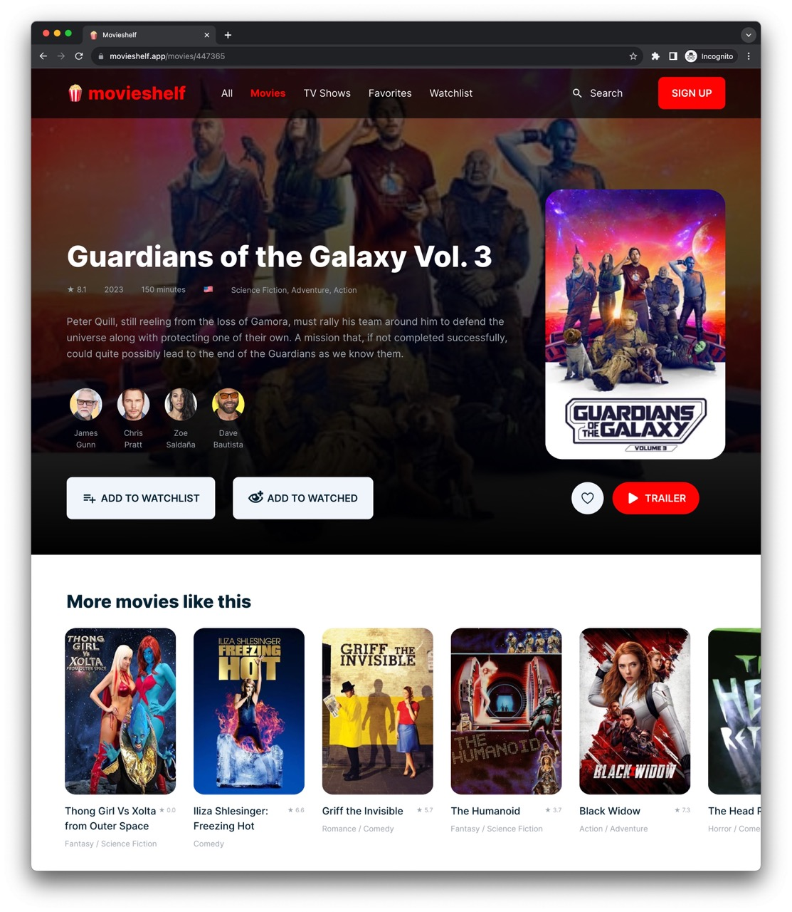

# 🍿 MovieShelf

Open-source movie, TV and cast catalog powered by The Movie Database (TMDB).
Take a look at it running at https://movieshelf.app.



## Stack

- [Next.js 16](https://nextjs.org) (App Router, RSC, Turbopack)
- [React 19](https://react.dev)
- [Tailwind CSS 4](https://tailwindcss.com) + [Shadcn UI](https://ui.shadcn.com)
- [Zustand](https://zustand-demo.pmnd.rs) (single store: watch-provider country, persisted)
- [next-themes](https://github.com/pacocoursey/next-themes) for light/dark/system
- [@leandrowkz/tmdb](https://github.com/leandrowkz/tmdb) to talk to TMDB

Data fetching is done via server actions in `actions/`, each wrapped with
`unstable_cache` for tag-based revalidation. There are no client-side API
hooks and no `app/api` route handlers — server components call actions directly.

## Folder layout

```
app/         routes (App Router)
actions/     server actions wrapping TMDB
components/  components (one folder per component, kebab-case)
hooks/       hooks and zustand stores
lib/         cross-app utilities (tmdb client, seo, images, formatting)
types/       shared types
public/      static assets
```

Naming convention: `DOM + Action + Entity` (e.g. `CardMovie`, `ListPeople`,
`ButtonTrailer`, `FormSearch`). One export per file matching the filename.

## Running locally

1. Install dependencies: `npm install`
2. Create a `.env.local` with your [TMDB v3 API key](https://developer.themoviedb.org/docs/getting-started):
   ```
   TMDB_API_ACCESS_TOKEN=your_key_here
   NEXT_PUBLIC_SITE_URL=http://localhost:3000
   ```
3. Start the dev server: `npm run dev`
4. Open http://localhost:3000

## Scripts

| Command           | Description                                |
| ----------------- | ------------------------------------------ |
| `npm run dev`     | Start dev server (Turbopack)               |
| `npm run build`   | Production build with SSG/SSR/SSG params   |
| `npm start`       | Run the production build                   |
| `npm run lint`    | Run ESLint                                 |
| `npm run typecheck` | Run TypeScript without emitting           |

## SEO

- Per-page `generateMetadata` with canonical URLs, OpenGraph, Twitter card
- Dynamic 1200×630 OpenGraph images per movie / show / person via `next/og`
- JSON-LD: `WebSite` + `SearchAction` in root, `Movie` / `TVSeries` / `Person` per page
- `app/sitemap.ts` (top movies/shows + all genres, revalidate 24h)
- `app/robots.ts` allow-all + sitemap pointer
- Top-20 trending movies + top-20 popular TV shows pre-rendered at build via
  `generateStaticParams`; the rest are SSR'd on demand and cached

## The Movie Database API

This product uses the TMDB API but is not endorsed or certified by TMDB.
All movies, TV shows and cast information come from the TMDB API.

<p>
  
</p>
